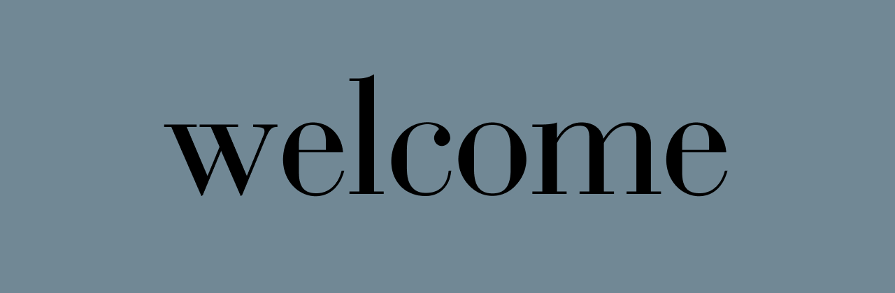

<!--
<table align="right">
 <tr><td><a href="https://github.com/rohxn-o/rohxn-o/tree/main/README.md"> English</a></td></tr>
 <tr><td><a href="https://github.com/rohxn-o/rohxn-o/tree/main/README-gu.md"> Gujarati</a></td></tr>
</table>
-->

  

## Projects

- [ ] StarGuard
- [ ] Study App
- [x] ~~Website~~

## Stats

 

## Work Environments

  
  
  
  
  
  
  
  
  
  

